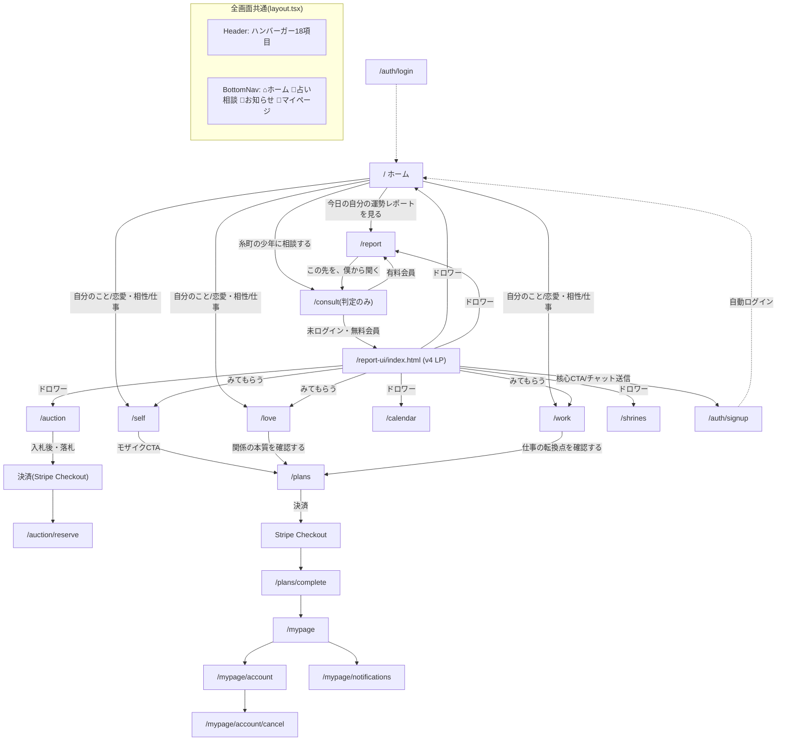
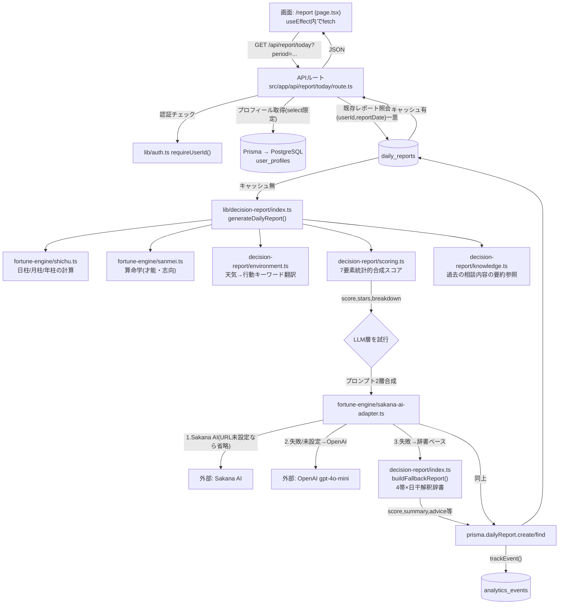
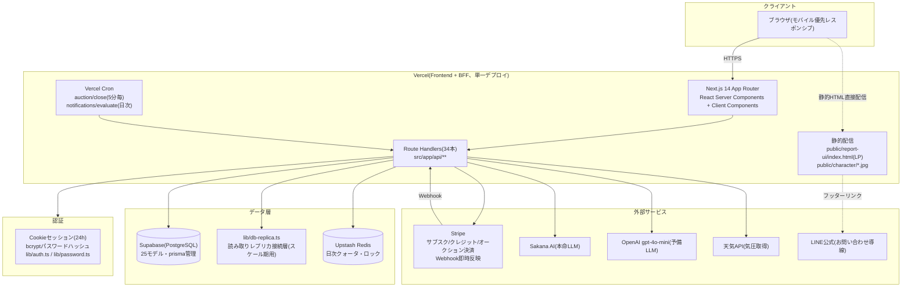
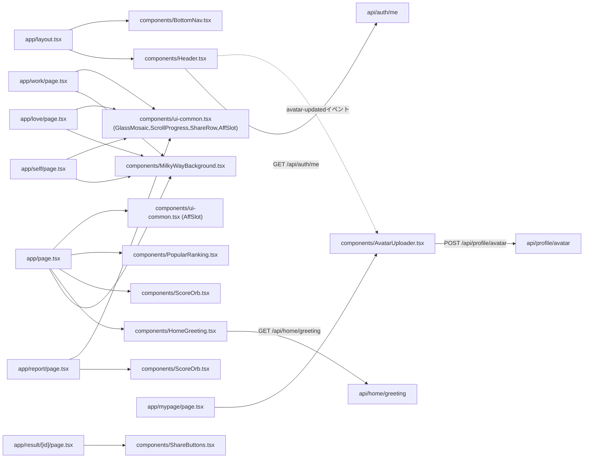

# 糸町の少年 — Architecture Blueprint(Single Source of Truth)

最終更新: 2026-07-08 / 対象コミット: e8369f4

**本ドキュメントが設計上の唯一の正(SSoT)である。**
旧3部構成(project-structure.md / ui-blueprint.md / architecture.md)と旧ARCHITECTURE.mdを統合した。
仕様の原典は `docs/design/00_ceo_decisions/` のCEO決定事項群であり、本Blueprintはその実装済み状態を反映する。
両者が矛盾する場合はCEO決定が優先、本Blueprintを追随修正すること。

---

# 第1部: プロジェクト構成・デザインシステム


## ① プロジェクト全体構成

「糸町の少年」は、Next.js 14(App Router)による**フルスタック1リポジトリ構成**の占いWebサービス。フロントエンド・BFF・占術計算エンジンが同一コードベースに同居し、外部サービス(Supabase/Postgres、Upstash Redis、Stripe、Sakana AI/OpenAI)と連携する。

- **ドメイン**: 四柱推命・算命学・姓名判断・暦注(風水)を用いた日次運勢/相性/キャリア占い + AIチャット相談 + 電話占いオークション(トークション)
- **収益モデル**: サブスク(月額980円・チャット5回/日)+ クレジット追加購入 + トークション落札額
- **ユーザー種別**: 未ログイン / 無料会員(チャット1回/日) / 有料会員(チャット5回/日+追加購入)
- **キャラクター**: 「糸町の少年」(蛙のキャラクター)による一人称固定・占術用語非開示のチャット人格
- **世界観**: 天の川・提灯・藍色の夜という和風ファンタジー(MilkyWayBackground共通コンポーネントで全画面統一)

---

## ② ディレクトリ構成

```
fortune_verify/
├─ src/
│  ├─ app/                      # Next.js App Router(ページ+APIルート)
│  │  ├─ (25 ページディレクトリ)  # 詳細は第2部 ページ一覧参照
│  │  ├─ api/                   # 34 Route Handlers(BFF層)
│  │  │  ├─ auth/               # login, signup, logout, me
│  │  │  ├─ chat/                # 占いチャット(会員種別クォータ制御込み)
│  │  │  ├─ report/today/        # 今日の運勢(期間別: today/week/month/nextMonth)
│  │  │  ├─ self, love, work/reading  # 3診断の占いエンジン接続API
│  │  │  ├─ billing/             # subscribe, credit, webhook, auction/bid
│  │  │  ├─ auction/              # 一覧・入札・決済・予約・自動終了(cron)
│  │  │  ├─ calendar, calendar/fengshui  # 四柱×暦注カレンダー
│  │  │  ├─ shrines, ranking, referral, weather
│  │  │  ├─ profile/avatar        # アバター画像設定
│  │  │  ├─ admin/                # 運営ダッシュボード用API
│  │  │  ├─ notifications/        # 設定・評価バッチ(cron)
│  │  │  └─ health                # 死活監視
│  │  ├─ layout.tsx               # 全ページ共通シェル(Header+BottomNav常設)
│  │  └─ globals.css              # デザイントークン実体・.inputクラス等
│  │
│  ├─ components/                 # 共通UIコンポーネント(10ファイル。詳細は⑦)
│  ├─ lib/
│  │  ├─ fortune-engine/           # 占術計算コア(11ファイル。詳細は第3部)
│  │  ├─ decision-report/          # 「今日の運勢」生成パイプライン(scoring/environment/knowledge/index)
│  │  ├─ auth.ts, db.ts, db-replica.ts, redis.ts, stripe.ts, weather.ts
│  │  ├─ analytics.ts, experiments.ts, feature-store.ts  # スケール期の分析基盤
│  │  ├─ calendar-adapter.ts, recommendation.ts, talkauction.ts, password.ts
│  │  └─ (合計28ファイル)
│  └─ generated/prisma/            # Prisma Client自動生成物(gitignore対象)
│
├─ prisma/
│  ├─ schema.prisma                # 25モデル(詳細は第3部 データモデル)
│  └─ manual_*.sql                 # 手動マイグレーション(Supabase適用用)
│
├─ public/
│  ├─ character/                   # キャラクター画像(ホーム/レポートヒーロー等)
│  └─ report-ui/index.html         # v4 LP静的配信(itomachi_report_ui_v4と同期運用)
│
├─ prompts/
│  ├─ chat/system_prompt.v2.4.md   # キャラクター人格プロンプト(Layer1)
│  ├─ analysis/                    # 占術分析基礎プロンプト(Layer0)+算命学インデックスJSON
│  └─ content/                     # ネクストアクションテンプレート
│
├─ docs/                           # 設計ドキュメント(本Blueprint含む)
│  └─ design/00_ceo_decisions〜08_talkauction/  # CEO決定・競合分析・ブランド・スケール設計等
│
├─ scripts/integration_test.sh     # 結合テスト(86項目)
├─ next.config.mjs, tailwind.config.ts, prisma.config.ts
└─ vercel.json                     # Cron設定(オークション自動終了・通知評価バッチ)
```

**担当分界**: `app/`=画面とBFF、`lib/fortune-engine/`=占術の数式・辞書そのもの(UIに依存しない純粋関数群)、`lib/decision-report/`=占術結果をレポート形式に合成する中間層、`components/`=見た目の再利用部品。

---

## ⑦ 共通コンポーネント一覧

| コンポーネント | 役割 | 主な利用ページ |
|---|---|---|
| `Header.tsx` | 全画面共通ヘッダー。ハンバーガーメニュー(18項目)+人マーク(ログイン状態でアバター/頭文字/アイコン切替) | 全ページ(layout.tsx) |
| `BottomNav.tsx` | 下部固定ナビ(ホーム/占い相談/お知らせ/マイページ)。LP(v4)のマスターデザインと統一 | 全ページ(layout.tsx) |
| `MilkyWayBackground.tsx` | 天の川背景+控えめな流れ星演出(端のみ・7-16秒間隔) | ホーム・自分のこと・恋愛・仕事 |
| `HomeGreeting.tsx` | 3軸(天気×四柱)スコアリングによる挨拶文表示 | ホーム |
| `ScoreOrb.tsx` | 円環スコアメーター(★+点数のドーナツ表示) | ホーム・今日の運勢 |
| `ChatWindow.tsx` | 占いチャットUI(送受信・402/409/401分岐対応) | /consult(有料会員直行時) |
| `AvatarUploader.tsx` | 画像選択→256px正方形縮小→アップロード | マイページ |
| `PopularRanking.tsx` | 人気占いランキング表示 | ホーム |
| `ShareButtons.tsx` | SNS共有(X/Instagram/TikTok/LINE) | 結果共有ページ |
| `ui-common.tsx` | 汎用部品集約: `GlassMosaic`(有料壁のぼかし), `ScrollProgress`, `FloatingCTA`, `ShareRow`, `AffSlot`(アフィ余白枠) | レポート・自分のこと・恋愛・仕事・神社詳細等ほぼ全診断系ページ |

---

## ⑧ デザインシステム

### カラー(tailwind.config.ts extend.colors)
| トークン | 値 | 用途 |
|---|---|---|
| `ink-950` | `#101026` | 背景最深部(夜の社) |
| `ink-900` | `#15152F` | カード背景 |
| `ink-800` | `#1E1E3D` | サブ背景 |
| `ink-700` | `#2A2A52` | ボーダー |
| `gold-400/500/600` | `#E4BE5C` / `#D9A62E` / `#B8871E` | 灯籠の金(CTA・アクセント) |
| `torii-500/600` | `#C1443C` / `#A5342D` | 鳥居の朱(強調・警告系) |
| `paper-50/200/400/600` | `#F7F3E9`〜`#847C9C` | テキスト濃淡4段階 |
| `rose-*` | Tailwind標準 | 恋愛系ページのアクセント(love/page.tsx) |

### タイポグラフィ
- `font-display`: `var(--font-shippori)`(明朝体・見出し用)
- `font-body`: `var(--font-zenkaku)`(角ゴシック・本文用)
- `font-mono`: 等幅(コード的表示用)

### Spacing / Corner / Shadow
- `rounded-card`: `20px`(カード共通角丸)
- `shadow-lantern`: `0 0 40px -8px rgba(217,166,46,.35)`(灯籠の淡い金光彩。CTAボタン等)
- CTAボタンは共通で `shadow-[0_4px_0_#8a6b25]` の疑似立体(押下で`translate-y-0.5`)

### アイコン
- 下部ナビ: 絵文字ベース(⌂💬🔔👤)でLP(v4)と本体が統一
- ヘッダー人マーク: lucide-react `User`アイコン(未ログイン時)/ アバター画像 or ひらがな頭文字(ログイン時)

### アニメーション
- 診断結果の演出待機: 600ms(2026-07-07に1800msから短縮)
- LP初回ローディング: 1900ms
- 流れ星: 7-16秒間隔・端のみ出現(控えめ)

---

## ⑩ システムアーキテクチャ(概要)

詳細は第3部を参照。ここでは要素の一覧のみ:

- **Frontend**: Next.js 14 App Router + React 18 + TypeScript + Tailwind CSS
- **Backend(BFF)**: Next.js Route Handlers(`src/app/api/**`、34エンドポイント)。フロントと同一デプロイ単位(Vercel)
- **Database**: PostgreSQL(Supabase管理)+ Prisma ORM(25モデル)
- **Cache/Rate-limit**: Upstash Redis(REST API)。日次クォータカウンタ・ロック用
- **AI**: 3段フォールバック(Sakana AI → OpenAI gpt-4o-mini → 辞書ベースのフォールバック生成)
- **決済**: Stripe(サブスク・クレジット・トークション決済、Webhook即時反映)
- **認証**: 自前実装(Cookieセッション・24時間有効・bcryptハッシュ)
- **静的配信**: `public/report-ui/index.html`(LP、v4モックと同期運用)
- **監視/バッチ**: Vercel Cron(トークション自動終了5分毎・通知評価バッチ日次)、`/api/health`

---

## ⑬ 気付いたこと(現状分析のみ・改善提案は含まない)

1. **`/consult` は物理的にはページだが実質リダイレクタ**: サーバーコンポーネントでログイン状態→有料会員なら`/report`へ、それ以外はLP静的HTMLへ`redirect()`する薄い分岐ロジックのみ。UIを持たない特殊なルート。
2. **2つのLP実体が並存**: `public/report-ui/index.html`(本番配信)と `/mnt/user-data/outputs/itomachi_report_ui_v4.html`(編集元)を手動`cp`で同期する運用。Next.jsのビルドパイプラインには入っていない静的ファイル。
3. **`src/lib/fortune-engine/` と `src/lib/decision-report/` の2層構造**: 前者が占術そのものの計算(四柱推命・算命学・姓名判断・暦注・ホロスコープ・危機検知)、後者がそれらを合成してレポート文章・スコアにする層。責務は分離されているが、呼び出し関係はやや複雑(decision-report/index.tsが5つの占術関数を横断的に呼ぶ)。
4. **スコアリングロジックは2026-07-07に全面改訂済み**(`scoring.ts`)。四柱推命の月柱・年柱を新設し、7要素の加重合成+統計的リスケールで正規分布に近い分布(平均50・標準偏差16)を実現。旧ロジックとの後方互換フィールド(`base`/`envModifier`/`themeBonus`)がinterfaceに残存している。
5. **DailyReportはユニーク制約`(userId, reportDate)`でキャッシュされる**: 占術ロジックを変更しても、過去に生成済みのレポートは再計算されない。ロジック変更のたびに手動`DELETE FROM daily_reports`が運用上必要になっている(実際に本セッション内で複数回発生)。
6. **avatar列など、Prismaスキーマ変更と本番DB(Supabase)反映の間にタイムラグがある**: `findUnique`が全カラムSELECTする書き方だと、未反映のカラムがあるだけで該当APIが軒並み500になる障害が過去に発生。現在は主要APIで`select`を明示する対応済みだが、新規カラム追加時は同種のリスクが再発しうる構造。
7. **認証は独自実装**: NextAuth等のライブラリは使わず、Cookie+bcryptの自前実装。セッション24時間・`getCurrentUserId()`/`requireUserId()`という2種のヘルパーで任意/必須を使い分けている。
8. **アフィリエイト枠(`AffSlot`)は全ページに配置済みだが中身は未実装**: 「配置ルール(1セクション→下1枠/3セクション以上→中央+下)」に従った余白のみで、広告タグ等の実装はまだない。

---

# 第2部: UI(ページ・遷移・画面構造)


## ③ ページ一覧(全25画面)

| 画面名 | Route | 対応ファイル | 説明 |
|---|---|---|---|
| ホーム | `/` | `src/app/page.tsx` | 3軸挨拶+スコアオーブ+「相談する」入口+人気ランキング。全体のハブ |
| 占い相談(入口) | `/consult` | `src/app/consult/page.tsx` | UIなし。有料会員→`/report`へredirect、それ以外→LP(`/report-ui/index.html`)へredirect |
| 今日の運勢 | `/report` | `src/app/report/page.tsx` | 期間タブ(今日/今週/今月/来月)。スコア・行動方針・注意点・モザイク+CTA |
| 自分のこと | `/self` | `src/app/self/page.tsx` | 名前+生年月日→本質診断。結果サンプル→入力→ローディング→結果 |
| 恋愛・相性 | `/love` | `src/app/love/page.tsx` | 2名の名前→姓名判断ベースの相性。3層構造(表層/中層/深層ロック) |
| 仕事・キャリア | `/work` | `src/app/work/page.tsx` | 名前+生年月日+状況→算命学。業界×部署の相性(有料ロック) |
| 風水カレンダー | `/calendar` | `src/app/calendar/page.tsx` | 月表示カレンダー。開運日/注意日、非会員=汎用/会員=個人最適化 |
| トークション一覧 | `/auction` | `src/app/auction/page.tsx` | 電話占いオークションチケット一覧・入札・決済導線 |
| トークション予約 | `/auction/reserve` | `src/app/auction/reserve/page.tsx` | 落札者専用。決済完了後の日程予約 |
| 縁のある神社(一覧) | `/shrines` | `src/app/shrines/page.tsx` | おすすめ神社一覧(タグベース) |
| 縁のある神社(詳細) | `/shrines/[id]` | `src/app/shrines/[id]/page.tsx` | 個別神社。画像・埋込動画・SNSリンク・運営レビュー |
| お知らせ | `/news` | `src/app/news/page.tsx` | 運営告知一覧(現状ダミーデータ) |
| プラン購入 | `/plans` | `src/app/plans/page.tsx` | サブスク980円/クレジット300円のタブ切替購入画面 |
| 決済完了 | `/plans/complete` | `src/app/plans/complete/page.tsx` | Stripe Checkout完了後の着地 |
| マイページ | `/mypage` | `src/app/mypage/page.tsx` | アバター設定・会員種別・残回数/ポイント/クレジット・最近の診断 |
| アカウント設定 | `/mypage/account` | `src/app/mypage/account/page.tsx` | 会員情報・支払い管理 |
| 退会手続き | `/mypage/account/cancel` | `src/app/mypage/account/cancel/page.tsx` | 解約フロー(休会提案ワンクッションあり) |
| 通知設定 | `/mypage/notifications` | `src/app/mypage/notifications/page.tsx` | プッシュ/メール通知の切替 |
| ログイン | `/auth/login` | `src/app/auth/login/page.tsx` | メール+パスワード認証 |
| 会員登録 | `/auth/signup` | `src/app/auth/signup/page.tsx` | 氏名・生年月日・性別・メール登録 |
| 診断結果共有 | `/result/[id]` | `src/app/result/[id]/page.tsx` | SNS共有着地ページ。未ログインでも閲覧可(unlockedは判定制御) |
| お問い合わせ | `/support` | `src/app/support/page.tsx` | 公式LINEへの案内窓口 |
| 利用規約 | `/legal/terms` | `src/app/legal/terms/page.tsx` | 占いサービス向け11条規約 |
| プライバシーポリシー | `/legal/privacy` | `src/app/legal/privacy/page.tsx` | 匿名加工データ利用条項を含む9項目 |
| 特定商取引法表記 | `/legal/tokushoho` | `src/app/legal/tokushoho/page.tsx` | 事業者情報・返金ポリシー |
| 運営ダッシュボード | `/admin/analytics` | `src/app/admin/analytics/page.tsx` | ADMIN_SECRET保護。KPI・実験結果閲覧 |

**LP(準ページ扱い)**: `/report-ui/index.html`(`public/`直下の静的HTML)。Next.jsのルーティング外だが、`/consult`のリダイレクト先として実質的な「26番目の画面」。編集は`itomachi_report_ui_v4.html`との手動同期で行う運用。

---

## ④ ページ遷移図(ユーザー種別ごと)



### 未ログインユーザー
- 診断(self/love/work)は**閲覧可**、結果は無料部分のみ表示、深層/部署特定/モザイク部はロック
- `/report`, `/calendar`, `/shrines`, `/news`は閲覧可(個人最適化なしの汎用表示)
- `/mypage`系は307で`/auth/login`へリダイレクト
- チャット(`POST /api/chat`)は401 → ログイン誘導CTA

### 無料会員(ログイン済み・サブスクなし)
- チャット1回/日。2回目以降は402 → 「もっと占う ※初月500円 月額980円」CTA→`/plans`
- `/report`は今日のみ全文、今週以降はモザイク
- love/workの深層はロックのまま

### 有料会員(サブスクactive)
- `/consult`が**LPを経由せず直接`/report`へ**(LP再訪防止のUX最適化)
- チャット5回/日。超過後はポイント→クレジット消費。クレジットも尽きたら「追加5回¥300」
- `/report`4期間すべて全文、love深層・work部署特定も解放

---

## ⑤ UI Blueprint(画面構造・ワイヤーフレーム)

### ホーム(`/`)
```
┌─────────────────────────┐
│ Header(ロゴ/人マーク/☰)    │
├─────────────────────────┤
│ [ヒーロー画像: ライト/ダーク切替] │
│ ITOMACHI NO SHONEN          │
│ <HomeGreeting/> (3軸挨拶文)  │
│ <ScoreOrb/> 今日のスコア      │
│ [今日の自分の運勢レポートを見る] │
├─────────────────────────┤
│ 相談する                     │
│ [糸町の少年に相談する](大CTA)  │
│ [自分のこと][恋愛・相性][仕事]  │
├─────────────────────────┤
│ <PopularRanking/>            │
├─────────────────────────┤
│ 縁のある神社バナー枠           │
├─────────────────────────┤
│ <AffSlot/> (真ん中)           │
│ ...                          │
│ <AffSlot/> (下部)             │
├─────────────────────────┤
│ BottomNav(⌂💬🔔👤)          │
└─────────────────────────┘
```

### 今日の運勢(`/report`)
```
┌─────────────────────────┐
│ Header                        │
│ [ヒーロー画像 report_hero]     │
│ 今日の運勢                     │
│ [今日][今週][今月][来月] タブ    │
├─────────────────────────┤
│ <ScoreOrb/> + ★評価             │
│ キーワード3つ(grid-cols-3)      │
│ 今日の行動方針(section)          │
│ 今日、気をつけること(3項目)       │
│ <AffSlot/>(枠1)                 │
│ 総合アドバイス                    │
│ <AffSlot/>(枠2)                 │
│ [モザイク: 核心部]+CTA「僕から聞く」│
│ <AffSlot/>(枠3)                 │
│ <ShareRow/>                     │
├─────────────────────────┤
│ BottomNav                       │
└─────────────────────────┘
```

### 診断系共通(`/self` `/love` `/work`)
```
┌─ input フェーズ ──────────┐
│ Header + MilkyWayBackground   │
│ 見出し+リード文                 │
│ 入力フォーム(名前/生年月日/状況) │
│ [診断する]ボタン                │
│ アフィ枠                        │
│ 「この占いでわかること」メニュー   │
└──────────────────────┘
        ↓ 600ms演出
┌─ loading フェーズ ────────┐
│ スピナー + 「◯◯しています、、」  │
└──────────────────────┘
        ↓
┌─ result フェーズ ─────────┐
│ 本質/中長期/行動方針(無料部分)   │
│ アフィ枠                        │
│ [モザイク: 深層/部署特定]+CTA    │
│ アフィ枠                        │
└──────────────────────┘
```

### トークション(`/auction`)
```
┌─────────────────────────┐
│ Header                        │
│ トークション                    │
│ チケット情報section(タイトル/説明)│
│ 現在価格・入札履歴section         │
│ 入札フォームsection              │
│ 注意事項section                 │
│ (落札後: 決済ボタン→Stripe)      │
├─────────────────────────┤
│ BottomNav                       │
└─────────────────────────┘
```

### マイページ(`/mypage`)
```
┌─────────────────────────┐
│ Header                        │
│ [AvatarUploader] + 名前 + 会員種別│
│ [残回数][ポイント][クレジット] 3列 │
│ 最近の診断リスト                  │
│ メニューリンク(プラン/通知/退会等) │
├─────────────────────────┤
│ BottomNav                       │
└─────────────────────────┘
```

---

## ⑥ UIサムネイル一覧

スクリーンショット取得・Figma連携は本環境では実施不可のため、**ASCIIワイヤーフレーム(上記⑤)で代替**した。実機/ブラウザでのスクリーンショット一覧が必要な場合は、Vercelデプロイ後のプレビューURLに対して別途取得ツールでの収集を推奨する。

---

## ⑫ UXフロー(初回訪問〜レポート閲覧)

```mermaid
flowchart TD
    A[初回アクセス /] --> B{ハンバーガーorカードを見る}
    B --> C["自分のこと/恋愛/仕事を選択"]
    C --> D[名前・生年月日など入力]
    D --> E[600ms演出ローディング]
    E --> F[無料部分の結果を閲覧]
    F --> G{もっと知りたい}
    G -->|Yes| H[モザイク部のCTAをタップ]
    H --> I{ログイン済み?}
    I -->|No| J[/auth/signup 会員登録]
    J --> K[自動ログイン→元画面に近い体験]
    I -->|Yes・無料会員| L[/plans サブスク案内]
    L --> M[Stripe Checkout]
    M --> N[/plans/complete]
    N --> O[/mypage]
    G -->|No| P[ホームに戻る/他の診断を見る]
    F --> Q["占い相談(チャット)を試す"]
    Q --> R{会員種別}
    R -->|未ログイン| S[LP(v4)でデモ体験→登録誘導]
    R -->|有料会員| T[/report に直接誘導]
```

**観察されるUXの特徴**:
- 初回接触点が「ホームのカード」「LP経由」の2系統ある(§⑬でも既存分析済みの二重入口)
- 診断→結果→モザイク→CTAという「寸止め」型のCVR設計が self/love/work/report で共通パターン化されている
- 有料会員だけがLPをスキップされる=UXの分岐点は「サブスクの有無」の1箇所に集約されている

---

# 第3部: システムアーキテクチャ・データフロー


## ⑨ データフロー(画面→Hooks→Service→API→AI→DB→Storage)

厳密な意味での「Hooks層」(カスタムReact Hooksの独立ファイル群)は本プロジェクトには存在せず、各ページコンポーネント内の`useEffect`/`useState`が直接`fetch`でAPIを叩く構成。代表例として「今日の運勢」のフルフローを示す。



**Storage層について**: 画像アセット(キャラクター画像・アバター)はファイルストレージサービスを使わず、**アバターはdata URL(base64)としてPostgres列に直接保存**、キャラクター画像は`public/character/`の静的ファイルとしてVercelのCDN配信に委ねている。専用オブジェクトストレージ(S3等)は未導入。

---

## ⑩ システムアーキテクチャ(詳細)



**特記事項**:
- Frontend/BackendがVercel上の**単一デプロイ**に統合されており、マイクロサービス的な分割はない
- `db-replica.ts`はスケール期(GM10設計)を見越した読み取り分散の準備層で、現行トラフィック規模では実質シングルDB接続と同義
- 認証は外部IDaaS(Auth0等)を使わない自前実装

---

## ⑪ コンポーネント依存関係(主要部分)



**依存の性質**: `ui-common.tsx`(GlassMosaic/ScrollProgress/ShareRow/AffSlot)が事実上「診断系ページ共通のCVRキット」として最も広く再利用されている。`MilkyWayBackground`は世界観統一のための純粋な装飾コンポーネントで、ロジックへの依存はない。

---

## データモデル一覧(25モデル、Prisma)

| モデル | 役割 |
|---|---|
| User / UserProfile | 認証情報とPII(氏名・生年月日等)を分離した1:1構成 |
| FortuneSession / FortuneMessage / FortuneResult | チャット占いのセッション・メッセージ・結果 |
| DailyUsage | 日次利用回数カウンタ(Redis正・DB副の二重化) |
| DailyReport | 「今日の運勢」の生成結果キャッシュ。`(userId,reportDate)`一意制約 |
| Subscription | サブスク状態(status=active等) |
| CreditBalance / CreditTransaction | 追加クレジット残高・履歴 |
| PointBalance / PointTransaction | ポイント残高・履歴(クォータ超過時の中間消費層) |
| AuctionTicket / Bid / AuctionReservation / AuctionReview | トークション(オークション形式電話占い)の一式 |
| NotificationSetting / NotificationLog | 通知設定・送信履歴 |
| Shrine / ShrineReview | 神社情報(media列で画像/動画/SNS対応)・運営レビュー |
| KnowledgeEntry | チャット内容の要約蓄積(レポート生成時の文脈参照用) |
| AnalyticsEvent / UserFeature / ExperimentAssignment | スケール期の分析基盤(イベントログ・特徴量・A/Bテスト割当) |
| AuditLog | 監査ログ |

---

## 主要な設計原則(コードコメントから抽出)

1. **占術の内訳を絶対にユーザーへ開示しない**: 「四柱推命」「算命学」等の用語はUIに出さず、キャラクター(糸町の少年)の言葉に翻訳して伝える
2. **AIはスコアを決めない**: スコアリングはルールベース(`scoring.ts`)で決定論的に算出し、LLMは解釈・文章生成のみを担当する(監査可能性の確保)
3. **気象値の生表示禁止**: 気圧等の生値をLLMに渡さず、`environment.ts`で人間行動キーワードに事前翻訳してから渡す
4. **3段フォールバックでサービスを止めない**: LLM層はSakana AI→OpenAI→辞書ベースの順で必ず何かを返す設計
5. **DBカラム追加時は`select`明示が必須**(運用上の教訓): `findUnique`の全カラム取得は、本番マイグレーション未適用時に該当API全体を500にする実障害を過去に起こしている

---

# 第4部: AI Development OS の設計(旧ARCHITECTURE.mdより移植)


（この章はPROJECT_CHARTER.mdの構想を踏襲。技術スタック非依存のため変更なし）

### 概念図

```
┌──────────────────────────────────────────────────────────┐
│                  GitHub Repository                       │
│         (Single Source of Truth for all artifacts)      │
│  - Code / Tests / Docs / Prompts / Infrastructure       │
└──────────────────────────────────────────────────────────┘
                          ↓
┌──────────────────────────────────────────────────────────┐
│            AI Development OS Orchestrator                │
│              (Coordinates all AI agents)                 │
└──────────────────────────────────────────────────────────┘
           ↓
    ┌──────┴──────┬──────────┬──────────┬────────────┐
    ↓             ↓          ↓          ↓            ↓
┌──────────┐ ┌──────┐ ┌────────┐ ┌───────┐ ┌────────────┐
│  Claude  │ │ChatGPT│ │ Gemini │ │Sakana │ │ Future AI  │
│(Core)    │ │(Text) │ │(Search)│ │(ML)   │ │ (Domain)   │
└──────────┘ └──────┘ └────────┘ └───────┘ └────────────┘
```

### AI ごとの役割定義

| AI | 主な責務 | 入力 | 出力 | 連携点 |
|---|---|---|---|---|
| **Claude** | 設計・実装・レビュー | Issue/PR/設計書 | コード/設計書 | GitHub |
| **ChatGPT** | 要件化・文案・プロンプト | ビジネス要件 | PRD/プロンプト | GitHub |
| **Gemini** | 市場調査・競合分析 | キーワード | 分析レポート | GitHub/Docs |
| **Sakana AI** | 推薦・スコアリング | ユーザー行動 | モデル・スコア公式 | API |

詳細は [AI_ROLE.md](./AI_ROLE.md) を参照。

### 実装済みの成果物受け渡し例（Phase1）

```
[Gemini] GM1〜GM8 競合分析・調査
    ↓ (docs/design/01_competitive_analysis/)
[ChatGPT] GPT1 キャラクター設定「ツクヨミ」
    ↓ (docs/design/02_brand_strategy/GPT1_character_design.md)
[ChatGPT] GPT3 チャットプロンプト設計
    ↓ (prompts/chat/GPT3_chat_prompt_design.md → system_prompt.v1.0.md に切り出し)
[Claude] CL8 占術統合エンジン実装
    → src/lib/fortune-engine/index.ts が system_prompt.v1.0.md を実行時に読み込む
[ChatGPT] GPT4 ネクストアクション文言テンプレート
    ↓ (prompts/content/GPT4_next_action_templates.md → next_action_templates.v1.0.json に構造化)
[Claude] CL9 占いチャット実装
    → src/lib/fortune-engine/sakana-ai-adapter.ts のモック応答が同JSONを参照
```

この一連の流れが、実際に「ドキュメント成果物 → 実装への取り込み」まで機能した最初の実例。

---


---

# 変更履歴(Blueprint運用開始後)

## 2026-07-08 要件対応(UI/UX・機能改善指示)

### 廃止
- **占いチャット機能(要件⑦)**: `/api/chat`とfortune-engine内チャット専用コード(generateFortune/カテゴリ別占術ルーティング)を削除。`CHARACTER_PROMPT`/`ANALYSIS_PROMPT`は全機能共通の人格・分析定義として`src/lib/fortune-engine/index.ts`に存置。`/consult`はチャットではなくLP誘導ページのため存続。
- **お知らせ(要件①)**: `/news`ページ・Header/BottomNav/LP/sitemapの導線を削除。BottomNavとLPの同位置にトークション(→/auction)を配置。Newsモデルは未作成のまま廃止確定。
- **未使用API**: `/api/weather`(各APIはlib/weatherを直接利用)・`/api/referral`(mypageサーバー側に同機能があり重複)。

### トークション(要件②)
- **開催前状態**: チケット未出品/scheduled時も完成版レイアウトを表示。次回開催日時(JST)・開催までのカウントダウン・ロック済み入札ボタン(「🔒開催までお待ちください」)を表示。次回ウィンドウは`nextScheduleWindows()`(月7:00/金20:00・24時間)から取得。
- **自動切替**: `scheduled→open`のlazy遷移を`/api/auction`と`/api/auction/status`に実装(cron不要のフェイルセーフ方針は終了処理と同じ)。クライアントはカウントダウン0到達で1回だけ再取得し、リロード無しで開催中UIへ切替。未出品時は30秒毎の一覧再取得で出品を検知。
- **入札ルール(CEO2および2026-07-05ルールを置き換え)**: 100円刻み(100の倍数)のみ有効。初回=開始価格1,000円ちょうど、以降=現在価格+100円が最低額。同額入札はルール上発生しないため旧・同額先着分岐は撤去。UIは±100円ステッパー+読み取り専用表示で不正価格の入力自体を不可能にし、サーバー側でも`BID_INVALID_STEP`/`BID_TOO_LOW`で二重検証。
- **API変更**: `/api/auction`応答に`serverNow`・`nextWindows`・`profileText`・`topics`を追加(topics/profileTextは画面が参照していたのにselect漏れしていた潜在バグの修正を兼ねる)。`/api/auction/status`応答に`bidCount`・`opensAt`を追加。

### 今日の運勢: 入力ファースト化(要件③)
- `/report`は診断前に必ず入力画面(名前・生年月日)を表示し、「診断を開始する」で結果へ進む2段階フローに変更。従来の自動フェッチは廃止。
- `/api/report/today`は`name`/`birthDate`クエリを受け取り、UserProfileへupsert(未登録なら作成・変更されていれば更新)してから診断。キャッシュ単位(userId×reportDate)は不変=DB変更なし。認証要件(401→ログイン誘導)は従来どおり。

### CTA変更: 占い相談導線の廃止→会員登録へ(要件⑥)
- 無料占い結果のCTA(「この先を、僕から聞く」「もっと詳しく相談する」「この結果について、僕に聞く」)の遷移先を`/consult`から`/auth/signup?from=<元画面>`へ変更。
- 入力引き継ぎ: 診断開始時に名前・生年月日を`sessionStorage`(キー`itomachi_fortune_input`、`src/lib/fortune-input.ts`)へ保存。signupはこれをプレフィル(姓名は空白分割、無ければ先頭1文字=姓のヒューリスティック)し、完了後は`from`の内部パスへ復帰(オープンリダイレクト対策で内部パスのみ許可)→復帰先でも入力がプレフィルされ、続きの占いへ途切れず進める。
- 有料プラン導線(GlassMosaic→`/plans`)は課金ファネルとして現状維持。`/consult`ページ自体はホーム・ランキング等の集客導線として存続。

### 無料占い品質改善(要件⑤)+天気の診断組み込み
- `src/lib/free-reading/`新設。「自分のこと」(`/self`+`/api/self/reading`)を、①あなたの本質(性格/才能/強み/弱み/思考パターン) ②現在の運勢(状況/流れ/注意/追い風・逆風) ③恋愛運 ④仕事運 ⑤金運 ⑥健康運 ⑦人間関係 ⑧未来(数ヶ月先/一年先/転機) ⑨行動指針(やる/避ける/上げる/具体策) ⑩締め の必須10セクション構成へ全面刷新。
- 生成は2段構え: LLM(Sakana AI→OpenAIフォールバック・JSON出力を全項目検証)→失敗時は辞書合成(四柱推命の日干状態/算命学の主星辞書/ホロスコープ/姓名判断の五格のみから決定論的に文章化)。どちらの経路も占術シグナル外の断定を持たない。
- 天気統合: 位置情報(任意)から気圧を取得し、低気圧時は健康運・現在の運勢・行動指針へ「コンディション配慮」として自然言語で反映(気象用語は使わない=CEO_UPDATE方針踏襲)。`/api/report/today`は従来から気圧を環境スコアへ反映済み。恋愛/仕事の相性系(`/love` `/work`)は出生データ由来の鑑定であり天候の影響を受けない設計のため対象外(設計判断)。
- サブスク限定の深掘りロック(行動特性・合わない環境)は既存ペイウォール仕様を維持。

### 認証: 12時間無操作で自動ログアウト(要件④。旧「Cookie24時間固定」CEO要求7/7を上書き)
- `src/middleware.ts`新設。リクエスト毎にセッションCookie(dev_user_id)の期限を12時間先へ延長するスライディング方式。12時間無操作で失効=自動ログアウト。失効後の`/mypage`系アクセスはログイン画面へリダイレクト。login/signupの初期maxAgeも12時間へ変更。Supabase Auth移行時もこの方針(12hアイドルタイムアウト)を引き継ぐこと。

### コードベース軽量化(2026-07-08確定分)
- 削除: `/api/chat`・`/news`・`/api/weather`・`/api/referral`・fortune-engineのチャット専用コード・入札の同額先着分岐・`src/lib/db-replica.ts`(CL30)・`src/lib/experiments.ts`(CL31)。CL30/31は参照ゼロのスケール先行実装で、必要時はgit履歴から復元する方針。`ExperimentAssignment`モデルはDB変更なし方針によりスキーマに温存(テーブルは無害)。
- ESLint導入: `eslint`+`eslint-config-next`(next/core-web-vitals)。警告0で運用開始。
