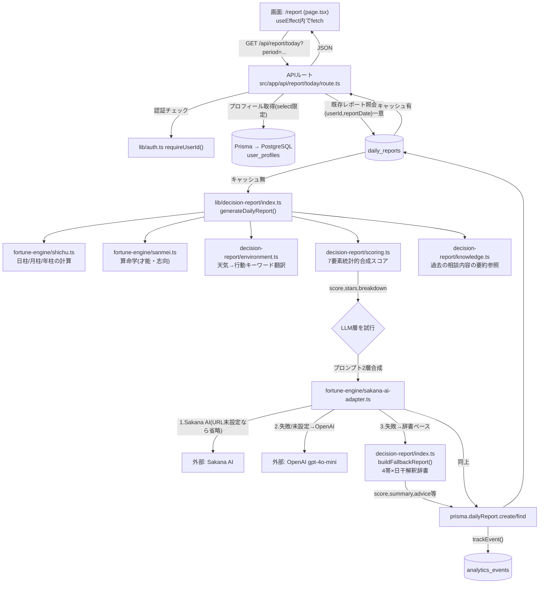
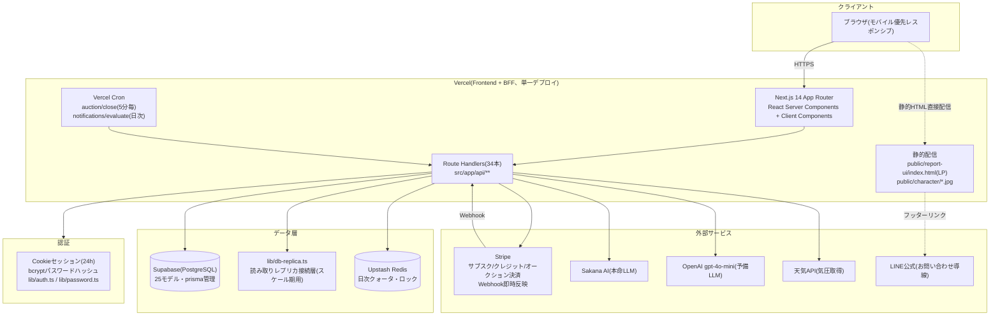
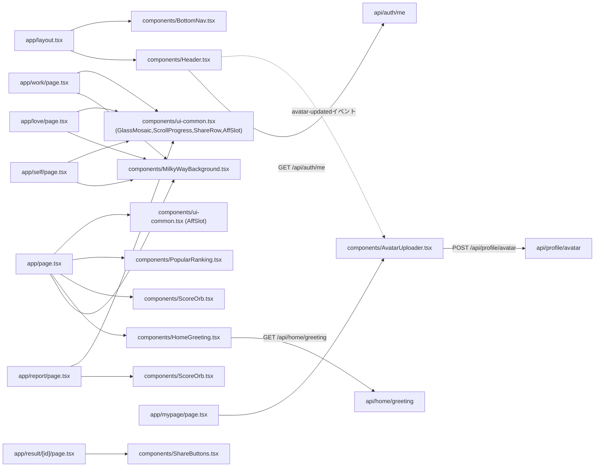

# 糸町の少年 — System Architecture & Data Flow

作成日: 2026-07-07 / 対象コミット: f18819d
**本ドキュメントは現状分析のみ。コードは一切変更していない。**

3部構成Blueprintの3本目。1本目=`docs/project-structure.md`、2本目=`docs/ui-blueprint.md`。

---

## ⑨ データフロー(画面→Hooks→Service→API→AI→DB→Storage)

厳密な意味での「Hooks層」(カスタムReact Hooksの独立ファイル群)は本プロジェクトには存在せず、各ページコンポーネント内の`useEffect`/`useState`が直接`fetch`でAPIを叩く構成。代表例として「今日の運勢」のフルフローを示す。

**Storage層について**: 画像アセット(キャラクター画像・アバター)はファイルストレージサービスを使わず、**アバターはdata URL(base64)としてPostgres列に直接保存**、キャラクター画像は`public/character/`の静的ファイルとしてVercelのCDN配信に委ねている。専用オブジェクトストレージ(S3等)は未導入。

---

## ⑩ システムアーキテクチャ(詳細)

**特記事項**:
- Frontend/BackendがVercel上の**単一デプロイ**に統合されており、マイクロサービス的な分割はない
- `db-replica.ts`はスケール期(GM10設計)を見越した読み取り分散の準備層で、現行トラフィック規模では実質シングルDB接続と同義
- 認証は外部IDaaS(Auth0等)を使わない自前実装

---

## ⑪ コンポーネント依存関係(主要部分)

**依存の性質**: `ui-common.tsx`(GlassMosaic/ScrollProgress/ShareRow/AffSlot)が事実上「診断系ページ共通のCVRキット」として最も広く再利用されている。`MilkyWayBackground`は世界観統一のための純粋な装飾コンポーネントで、ロジックへの依存はない。

---

## データモデル一覧(25モデル、Prisma)

| モデル | 役割 |
|---|---|
| User / UserProfile | 認証情報とPII(氏名・生年月日等)を分離した1:1構成 |
| FortuneSession / FortuneMessage / FortuneResult | チャット占いのセッション・メッセージ・結果 |
| DailyUsage | 日次利用回数カウンタ(Redis正・DB副の二重化) |
| DailyReport | 「今日の運勢」の生成結果キャッシュ。`(userId,reportDate)`一意制約 |
| Subscription | サブスク状態(status=active等) |
| CreditBalance / CreditTransaction | 追加クレジット残高・履歴 |
| PointBalance / PointTransaction | ポイント残高・履歴(クォータ超過時の中間消費層) |
| AuctionTicket / Bid / AuctionReservation / AuctionReview | トークション(オークション形式電話占い)の一式 |
| NotificationSetting / NotificationLog | 通知設定・送信履歴 |
| Shrine / ShrineReview | 神社情報(media列で画像/動画/SNS対応)・運営レビュー |
| KnowledgeEntry | チャット内容の要約蓄積(レポート生成時の文脈参照用) |
| AnalyticsEvent / UserFeature / ExperimentAssignment | スケール期の分析基盤(イベントログ・特徴量・A/Bテスト割当) |
| AuditLog | 監査ログ |

---

## 主要な設計原則(コードコメントから抽出)

1. **占術の内訳を絶対にユーザーへ開示しない**: 「四柱推命」「算命学」等の用語はUIに出さず、キャラクター(糸町の少年)の言葉に翻訳して伝える
2. **AIはスコアを決めない**: スコアリングはルールベース(`scoring.ts`)で決定論的に算出し、LLMは解釈・文章生成のみを担当する(監査可能性の確保)
3. **気象値の生表示禁止**: 気圧等の生値をLLMに渡さず、`environment.ts`で人間行動キーワードに事前翻訳してから渡す
4. **3段フォールバックでサービスを止めない**: LLM層はSakana AI→OpenAI→辞書ベースの順で必ず何かを返す設計
5. **DBカラム追加時は`select`明示が必須**(運用上の教訓): `findUnique`の全カラム取得は、本番マイグレーション未適用時に該当API全体を500にする実障害を過去に起こしている
