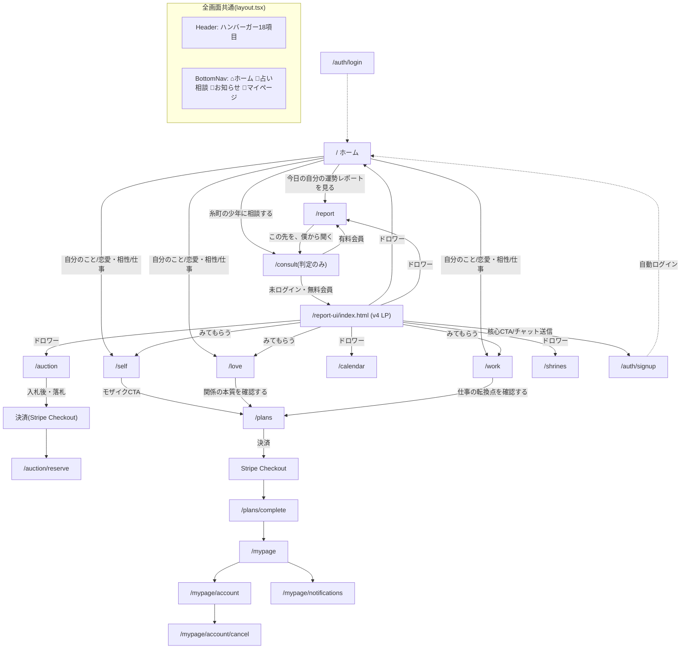

# 糸町の少年 — UI Blueprint(ページ・遷移・画面構造)

作成日: 2026-07-07 / 対象コミット: f18819d
**本ドキュメントは現状分析のみ。コードは一切変更していない。**

3部構成Blueprintの2本目。1本目=`docs/project-structure.md`(全体構成・コンポーネント・デザイン)、3本目=`docs/architecture.md`(システム・データフロー)。

---

## ③ ページ一覧(全25画面)

| 画面名 | Route | 対応ファイル | 説明 |
|---|---|---|---|
| ホーム | `/` | `src/app/page.tsx` | 3軸挨拶+スコアオーブ+「相談する」入口+人気ランキング。全体のハブ |
| 占い相談(入口) | `/consult` | `src/app/consult/page.tsx` | UIなし。有料会員→`/report`へredirect、それ以外→LP(`/report-ui/index.html`)へredirect |
| 今日の運勢 | `/report` | `src/app/report/page.tsx` | 期間タブ(今日/今週/今月/来月)。スコア・行動方針・注意点・モザイク+CTA |
| 自分のこと | `/self` | `src/app/self/page.tsx` | 名前+生年月日→本質診断。結果サンプル→入力→ローディング→結果 |
| 恋愛・相性 | `/love` | `src/app/love/page.tsx` | 2名の名前→姓名判断ベースの相性。3層構造(表層/中層/深層ロック) |
| 仕事・キャリア | `/work` | `src/app/work/page.tsx` | 名前+生年月日+状況→算命学。業界×部署の相性(有料ロック) |
| 風水カレンダー | `/calendar` | `src/app/calendar/page.tsx` | 月表示カレンダー。開運日/注意日、非会員=汎用/会員=個人最適化 |
| トークション一覧 | `/auction` | `src/app/auction/page.tsx` | 電話占いオークションチケット一覧・入札・決済導線 |
| トークション予約 | `/auction/reserve` | `src/app/auction/reserve/page.tsx` | 落札者専用。決済完了後の日程予約 |
| 縁のある神社(一覧) | `/shrines` | `src/app/shrines/page.tsx` | おすすめ神社一覧(タグベース) |
| 縁のある神社(詳細) | `/shrines/[id]` | `src/app/shrines/[id]/page.tsx` | 個別神社。画像・埋込動画・SNSリンク・運営レビュー |
| お知らせ | `/news` | `src/app/news/page.tsx` | 運営告知一覧(現状ダミーデータ) |
| プラン購入 | `/plans` | `src/app/plans/page.tsx` | サブスク980円/クレジット300円のタブ切替購入画面 |
| 決済完了 | `/plans/complete` | `src/app/plans/complete/page.tsx` | Stripe Checkout完了後の着地 |
| マイページ | `/mypage` | `src/app/mypage/page.tsx` | アバター設定・会員種別・残回数/ポイント/クレジット・最近の診断 |
| アカウント設定 | `/mypage/account` | `src/app/mypage/account/page.tsx` | 会員情報・支払い管理 |
| 退会手続き | `/mypage/account/cancel` | `src/app/mypage/account/cancel/page.tsx` | 解約フロー(休会提案ワンクッションあり) |
| 通知設定 | `/mypage/notifications` | `src/app/mypage/notifications/page.tsx` | プッシュ/メール通知の切替 |
| ログイン | `/auth/login` | `src/app/auth/login/page.tsx` | メール+パスワード認証 |
| 会員登録 | `/auth/signup` | `src/app/auth/signup/page.tsx` | 氏名・生年月日・性別・メール登録 |
| 診断結果共有 | `/result/[id]` | `src/app/result/[id]/page.tsx` | SNS共有着地ページ。未ログインでも閲覧可(unlockedは判定制御) |
| お問い合わせ | `/support` | `src/app/support/page.tsx` | 公式LINEへの案内窓口 |
| 利用規約 | `/legal/terms` | `src/app/legal/terms/page.tsx` | 占いサービス向け11条規約 |
| プライバシーポリシー | `/legal/privacy` | `src/app/legal/privacy/page.tsx` | 匿名加工データ利用条項を含む9項目 |
| 特定商取引法表記 | `/legal/tokushoho` | `src/app/legal/tokushoho/page.tsx` | 事業者情報・返金ポリシー |
| 運営ダッシュボード | `/admin/analytics` | `src/app/admin/analytics/page.tsx` | ADMIN_SECRET保護。KPI・実験結果閲覧 |

**LP(準ページ扱い)**: `/report-ui/index.html`(`public/`直下の静的HTML)。Next.jsのルーティング外だが、`/consult`のリダイレクト先として実質的な「26番目の画面」。編集は`itomachi_report_ui_v4.html`との手動同期で行う運用。

---

## ④ ページ遷移図(ユーザー種別ごと)



### 未ログインユーザー
- 診断(self/love/work)は**閲覧可**、結果は無料部分のみ表示、深層/部署特定/モザイク部はロック
- `/report`, `/calendar`, `/shrines`, `/news`は閲覧可(個人最適化なしの汎用表示)
- `/mypage`系は307で`/auth/login`へリダイレクト
- チャット(`POST /api/chat`)は401 → ログイン誘導CTA

### 無料会員(ログイン済み・サブスクなし)
- チャット1回/日。2回目以降は402 → 「もっと占う ※初月500円 月額980円」CTA→`/plans`
- `/report`は今日のみ全文、今週以降はモザイク
- love/workの深層はロックのまま

### 有料会員(サブスクactive)
- `/consult`が**LPを経由せず直接`/report`へ**(LP再訪防止のUX最適化)
- チャット5回/日。超過後はポイント→クレジット消費。クレジットも尽きたら「追加5回¥300」
- `/report`4期間すべて全文、love深層・work部署特定も解放

---

## ⑤ UI Blueprint(画面構造・ワイヤーフレーム)

### ホーム(`/`)
```
┌─────────────────────────┐
│ Header(ロゴ/人マーク/☰)    │
├─────────────────────────┤
│ [ヒーロー画像: ライト/ダーク切替] │
│ ITOMACHI NO SHONEN          │
│ <HomeGreeting/> (3軸挨拶文)  │
│ <ScoreOrb/> 今日のスコア      │
│ [今日の自分の運勢レポートを見る] │
├─────────────────────────┤
│ 相談する                     │
│ [糸町の少年に相談する](大CTA)  │
│ [自分のこと][恋愛・相性][仕事]  │
├─────────────────────────┤
│ <PopularRanking/>            │
├─────────────────────────┤
│ 縁のある神社バナー枠           │
├─────────────────────────┤
│ <AffSlot/> (真ん中)           │
│ ...                          │
│ <AffSlot/> (下部)             │
├─────────────────────────┤
│ BottomNav(⌂💬🔔👤)          │
└─────────────────────────┘
```

### 今日の運勢(`/report`)
```
┌─────────────────────────┐
│ Header                        │
│ [ヒーロー画像 report_hero]     │
│ 今日の運勢                     │
│ [今日][今週][今月][来月] タブ    │
├─────────────────────────┤
│ <ScoreOrb/> + ★評価             │
│ キーワード3つ(grid-cols-3)      │
│ 今日の行動方針(section)          │
│ 今日、気をつけること(3項目)       │
│ <AffSlot/>(枠1)                 │
│ 総合アドバイス                    │
│ <AffSlot/>(枠2)                 │
│ [モザイク: 核心部]+CTA「僕から聞く」│
│ <AffSlot/>(枠3)                 │
│ <ShareRow/>                     │
├─────────────────────────┤
│ BottomNav                       │
└─────────────────────────┘
```

### 診断系共通(`/self` `/love` `/work`)
```
┌─ input フェーズ ──────────┐
│ Header + MilkyWayBackground   │
│ 見出し+リード文                 │
│ 入力フォーム(名前/生年月日/状況) │
│ [診断する]ボタン                │
│ アフィ枠                        │
│ 「この占いでわかること」メニュー   │
└──────────────────────┘
        ↓ 600ms演出
┌─ loading フェーズ ────────┐
│ スピナー + 「◯◯しています、、」  │
└──────────────────────┘
        ↓
┌─ result フェーズ ─────────┐
│ 本質/中長期/行動方針(無料部分)   │
│ アフィ枠                        │
│ [モザイク: 深層/部署特定]+CTA    │
│ アフィ枠                        │
└──────────────────────┘
```

### トークション(`/auction`)
```
┌─────────────────────────┐
│ Header                        │
│ トークション                    │
│ チケット情報section(タイトル/説明)│
│ 現在価格・入札履歴section         │
│ 入札フォームsection              │
│ 注意事項section                 │
│ (落札後: 決済ボタン→Stripe)      │
├─────────────────────────┤
│ BottomNav                       │
└─────────────────────────┘
```

### マイページ(`/mypage`)
```
┌─────────────────────────┐
│ Header                        │
│ [AvatarUploader] + 名前 + 会員種別│
│ [残回数][ポイント][クレジット] 3列 │
│ 最近の診断リスト                  │
│ メニューリンク(プラン/通知/退会等) │
├─────────────────────────┤
│ BottomNav                       │
└─────────────────────────┘
```

---

## ⑥ UIサムネイル一覧

スクリーンショット取得・Figma連携は本環境では実施不可のため、**ASCIIワイヤーフレーム(上記⑤)で代替**した。実機/ブラウザでのスクリーンショット一覧が必要な場合は、Vercelデプロイ後のプレビューURLに対して別途取得ツールでの収集を推奨する。

---

## ⑫ UXフロー(初回訪問〜レポート閲覧)

```mermaid
flowchart TD
    A[初回アクセス /] --> B{ハンバーガーorカードを見る}
    B --> C["自分のこと/恋愛/仕事を選択"]
    C --> D[名前・生年月日など入力]
    D --> E[600ms演出ローディング]
    E --> F[無料部分の結果を閲覧]
    F --> G{もっと知りたい}
    G -->|Yes| H[モザイク部のCTAをタップ]
    H --> I{ログイン済み?}
    I -->|No| J[/auth/signup 会員登録]
    J --> K[自動ログイン→元画面に近い体験]
    I -->|Yes・無料会員| L[/plans サブスク案内]
    L --> M[Stripe Checkout]
    M --> N[/plans/complete]
    N --> O[/mypage]
    G -->|No| P[ホームに戻る/他の診断を見る]
    F --> Q["占い相談(チャット)を試す"]
    Q --> R{会員種別}
    R -->|未ログイン| S[LP(v4)でデモ体験→登録誘導]
    R -->|有料会員| T[/report に直接誘導]
```

**観察されるUXの特徴**:
- 初回接触点が「ホームのカード」「LP経由」の2系統ある(§⑬でも既存分析済みの二重入口)
- 診断→結果→モザイク→CTAという「寸止め」型のCVR設計が self/love/work/report で共通パターン化されている
- 有料会員だけがLPをスキップされる=UXの分岐点は「サブスクの有無」の1箇所に集約されている
